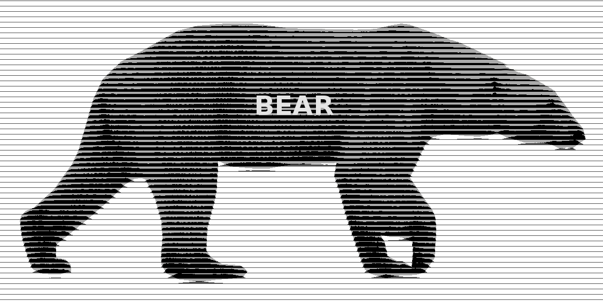

  
<b>Composition analysis of a Poolepynten <i>ursus maritimus</i> ancient sample</b>

 

<b>Download:</b>
<pre>
git clone https://github.com/pratas/bear.git
cd bear/
</pre>
<b>Download a build PUM:</b>
<pre>
chmod +x *.sh
GetBear.sh
bunzip *.bz
Trim.sh
</pre>

<b>Build the database (DB):</b>
<pre>
chmod +x *.sh
perl DownloadViruses.pl
perl DownloadArchaea.pl
perl DownloadBacteria.pl
perl DownloadFungi.pl
./DownloadMTV2.sh
./downloadPlastidV2.sh
</pre>

Attention: external links, namely from NCBI repositories, may be broken with time, although they are easily fixed.

<b>Dependencies:</b>
<pre>
FALCON
AdapterRemoval
</pre>
Although they are installed and used automatically.

License is GPLv3.
